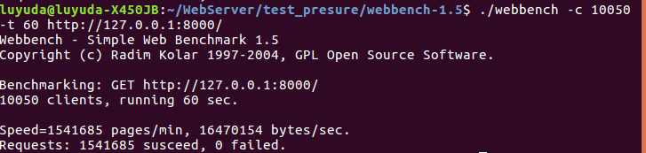

# CarfLib

CarfLib是用C++实现的linux下的高性能网络库，封装了网络编程的底层实现细节，使用者只需编写好相应的回调函数，可以极大提高开发效率。同时我还基于该网络库实现了一个简单的Web服务器，拥有用户登录和注册、图片浏览、视频播放等功能。
CarfLib的框架设计主要参考了@chenshuo的muduo网络库（ https://github.com/chenshuo/muduo ）。
Web服务器的实现借鉴了@qinguoyi的TinyWebServer（ https://github.com/qinguoyi/TinyWebServer ）。

## 特性
- Reactor模式+非阻塞I/O
- 线程池+one loop per thread
- 同时支持ET模式、LT模式
- 同步/异步日志系统
- 定时器定时提掉空闲连接
- 数据库连接池
- 使用智能指针管理对象

## 测试结果

利用webbench对服务器进行压力测试。线程池大小为5，模拟启10050个客户端，持续 60秒。 

1. LT模式

   

2. ET模式

   
